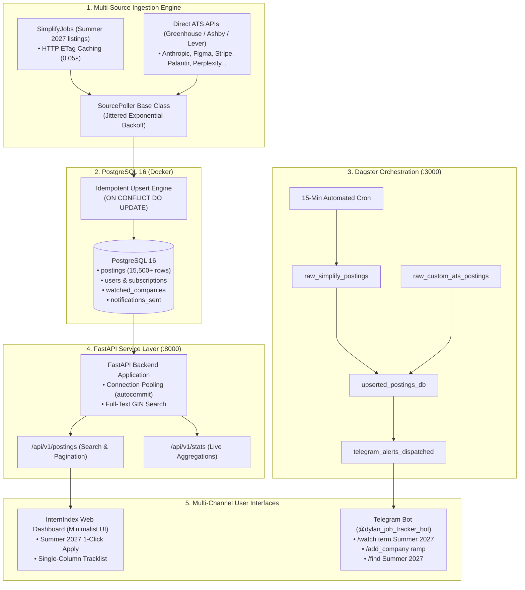

# InternIndex ⚡ — Real-Time Internship & Engineering Registry

An event-driven data engineering pipeline, multi-ATS watcher, and real-time alert system that ingests tech internship postings across aggregators and direct company ATS APIs (Greenhouse, Ashby, Lever), detects new openings via idempotent PostgreSQL diffing, and dispatches sub-second alerts (Telegram bot + minimalist Web Dashboard).

---

## 🏗️ Architecture Overview



---

## ✨ Key Features

1. **Multi-Source Ingestion & Zero-Load ETag Caching:**
   * Ingests 15,000+ tech listings from SimplifyJobs GitHub repositories (`Summer 2027`) and direct ATS public JSON feeds (Greenhouse, Ashby, Lever) in seconds.
   * Uses `If-None-Match: <etag>` HTTP caching on GitHub: completes in **0.058s (`HTTP 304 Not Modified`) with 0 bytes transferred and 0 database load** when unmodified.
2. **Custom Company ATS Watcher & Auto-Detection:**
   * Track any company's direct job board independent of Simplify:
     * 🟢 **Greenhouse:** Anthropic, Figma, Scale AI, Stripe, Datadog, Cloudflare, Airbnb, Anduril
     * 🔷 **Ashby:** Perplexity, Modal, Linear, Ramp, Cursor
     * 🔶 **Lever:** Palantir, Spotify, Netflix
   * Smart auto-detection via Telegram (`/add_company <name>`) and CLI (`uv run python scripts/check_company.py <name>`).
3. **Idempotent Storage & Change-Data-Capture:**
   * Uses PostgreSQL `INSERT INTO postings ... ON CONFLICT (source, external_id) DO UPDATE ... RETURNING (xmax = 0) AS is_new` to reliably identify brand-new job postings without duplicates.
4. **Minimalist Web Dashboard ("Roles" Design System):**
   * High-contrast, editorial interface served at `http://localhost:8000/`.
   * **Palette:** `#FAFAF8` (soft off-white), `#1A1A18` (text), `#6B6A63` (muted), `#2B4C3F` (deep pine green), `#E3E1D9` (hairline borders).
   * **Layout:** Plain stacked numerals (Summer 2027: 415, Active: 3,000, Companies: 500+), text tabs with active underline, single-column job list with bold company, regular role title, right-aligned mono metadata, and direct `Apply ↗` CTAs.
5. **Real-Time Telegram Push Alerts:**
   * Interactive bot (`@dylan_job_tracker_bot`) supporting:
     * `/watch term Summer 2027` — Alerts only for newly posted internships.
     * `/watch <Company>` — Alerts for specific target companies.
     * `/add_company <name>` — Dynamically tracks new company boards.
     * `/mode <instant|digest|pause>` — Switch between instant alerts and daily digests.
     * `/find <query>` — Instant database lookup from chat.
6. **Data Orchestration with Dagster:**
   * Software-Defined Assets (SDAs) and 15-minute recurring automated schedules visible in Dagster UI at `http://localhost:3000/`.

---

## 🚀 Quickstart (Running Locally on macOS / Linux)

### 1. Start PostgreSQL Database
```bash
docker compose up -d
```

### 2. Install Dependencies & Initialize Database
```bash
uv sync
uv run python db/init_db.py
```

### 3. Run Ingestion Pipeline
```bash
# Ingest all postings from SimplifyJobs & direct watched ATS boards
uv run python -m ingestion.runner
```

### 4. Start Services

Open separate terminals or run in background:

```bash
# Start FastAPI Backend & Web Dashboard (Port 8000)
uv run uvicorn api.main:app --host 127.0.0.1 --port 8000 --reload

# Start Dagster Orchestration Webserver (Port 3000)
uv run dagster dev -f orchestration/definitions.py -p 3000

# Start Telegram Alert Bot Daemon
uv run python -m notifications.bot
```

* **⚡ Web Dashboard:** [http://localhost:8000](http://localhost:8000)
* **📡 Interactive API Swagger Docs:** [http://localhost:8000/docs](http://localhost:8000/docs)
* **📊 Dagster Pipeline Graph:** [http://localhost:3000](http://localhost:3000)
* **🤖 Telegram Bot:** Connect to `@dylan_job_tracker_bot`

---

## 🤖 Telegram Bot Commands Reference

| Command | Description | Example |
| :--- | :--- | :--- |
| `/start` | Register user and initialize subscription. | `/start` |
| `/find <query> [count]` | Search active postings by role, keyword, or company. | `/find Summer 2027 10` |
| `/watch term <term>` | Subscribe to new postings for a recruiting season. | `/watch term Summer 2027` |
| `/watch <company>` | Subscribe to all new postings from a specific company. | `/watch Stripe` |
| `/watch keyword <keyword>`| Subscribe to postings containing a keyword. | `/watch keyword Machine Learning` |
| `/add_company <name>` | Auto-detect and track a company's direct ATS board. | `/add_company ramp` |
| `/companies` | List all tracked custom ATS company boards. | `/companies` |
| `/mode <instant\|digest>` | Set notification frequency preference. | `/mode instant` |
| `/list` | View your active subscriptions. | `/list` |
| `/unwatch <id\|all>` | Remove a subscription. | `/unwatch all` |

---

## 📡 REST API Reference

| Endpoint | Method | Description |
| :--- | :--- | :--- |
| `/api/v1/postings` | `GET` | Paginated search filtering by `term`, `company`, `keyword`, `is_remote`, and `is_active`. |
| `/api/v1/postings/{id}` | `GET` | Retrieve full posting metadata and raw JSON. |
| `/api/v1/stats` | `GET` | Real-time counts across data sources, recruiting terms, and top companies. |
| `/api/v1/health` | `GET` | Database connection pool readiness probe. |

---

## 🖥️ Production Self-Hosting (Arch Linux / Home NUC)

For 24/7 continuous operation on a home server or Arch Linux mini-PC using systemd and Docker Compose, check out the [Production Deployment Guide](file:///Users/dylanlouie/Projects/job-posting-tracker/deploy/README.md).
