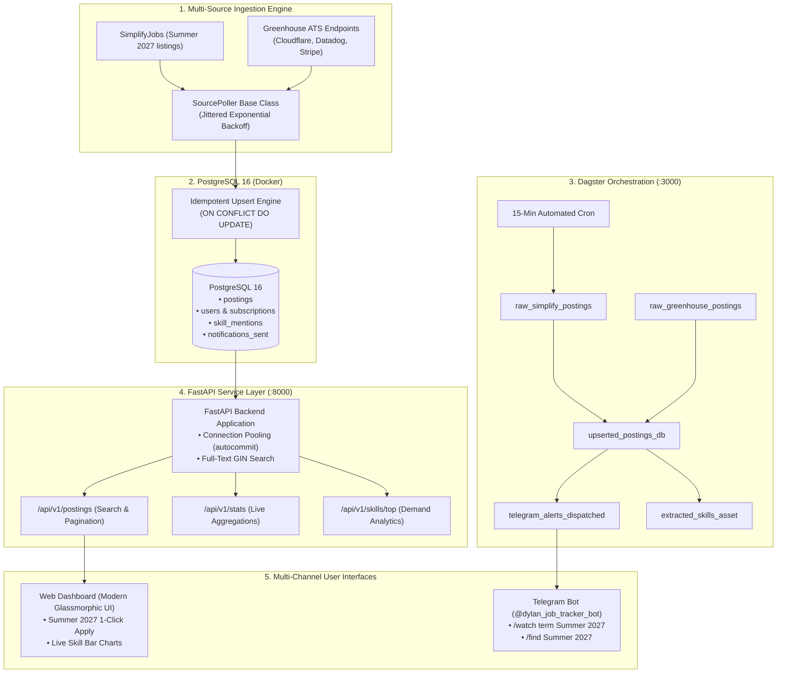

# InternPulse ⚡ — Real-Time Internship & Job Posting Tracker

An event-driven data engineering pipeline, analytics engine, and real-time alert system that ingests tech internship postings across aggregators and direct ATS JSON APIs (Greenhouse, Ashby, Lever), detects new openings via idempotent diffing, enriches job requirements, extracts in-demand skills, and provides multi-channel alerts (Telegram bot + modern web dashboard).

---

## 🏗️ Architecture Overview



---

## ✨ Key Features

1. **Multi-Source Ingestion:**
   * Ingests thousands of tech listings from SimplifyJobs GitHub repositories (`Summer 2027`) and direct company Greenhouse ATS public JSON feeds in under 6 seconds.
2. **Idempotent Storage & Change Detection:**
   * Uses PostgreSQL `INSERT INTO postings ... ON CONFLICT (source, external_id) DO UPDATE ... RETURNING (xmax = 0) AS is_new` to reliably identify brand-new job postings without duplicates.
3. **Lifecycle Filtering:**
   * Accurately parses `active` and `is_visible` flags to separate live open roles from expired historical records.
4. **Skill-Demand Extraction & Enrichment:**
   * Fetches full 5-paragraph job descriptions from ATS endpoints and extracts in-demand skills using curated regex word-boundary patterns across Languages (Python, Go, Java, Rust), Cloud & DevOps (AWS, GCP, Linux, Docker), and AI/Data (LLMs, PyTorch, SQL).
5. **Modern Web Dashboard:**
   * Dark-mode glassmorphic interface at `http://localhost:8000/` with instant term switching (`Summer 2027`, `Summer 2026`, `Fall 2026`), debounced keyword search, remote toggle, 1-click apply links, and dynamic skill demand bar charts.
6. **Real-Time Telegram Alerts:**
   * Interactive bot (`@dylan_job_tracker_bot`) supporting keyword/term watchlists (`/watch term Summer 2027`, `/watch Stripe`), instant searching (`/find Summer 2027`), and notification modes (instant vs. daily digest).
7. **Orchestration with Dagster:**
   * Software-Defined Assets (SDAs) and 15-minute recurring schedules visible in Dagster UI at `http://localhost:3000/`.

---

## 🚀 Quickstart (Running Locally on macOS / Linux)

### 1. Start PostgreSQL Database
```bash
docker compose up -d
```

### 2. Install Dependencies & Initialize Database
```bash
uv sync
uv run python db/init_db.py
```

### 3. Run Ingestion & Skill Extraction
```bash
# Ingest all postings from SimplifyJobs & Greenhouse
uv run python -m ingestion.runner

# Extract in-demand tech skills from job descriptions
uv run python -m processing.extractor
```

### 4. Start Services

Open separate terminals or run in background:

```bash
# Start FastAPI Backend & Web Dashboard (Port 8000)
uv run uvicorn api.main:app --host 127.0.0.1 --port 8000 --reload

# Start Dagster Orchestration Webserver (Port 3000)
uv run dagster dev -f orchestration/definitions.py -p 3000

# Start Telegram Alert Bot Daemon
uv run python -m notifications.bot
```

* **Web Dashboard:** [http://localhost:8000](http://localhost:8000)
* **Interactive API Swagger Docs:** [http://localhost:8000/docs](http://localhost:8000/docs)
* **Dagster Pipeline Graph:** [http://localhost:3000](http://localhost:3000)

---

## 📡 API Reference

| Endpoint | Method | Description |
| :--- | :--- | :--- |
| `/api/v1/postings` | `GET` | Paginated search filtering by `term`, `company`, `keyword`, `is_remote`, and `is_active`. |
| `/api/v1/postings/{id}` | `GET` | Retrieve full posting metadata and raw JSON. |
| `/api/v1/skills/top` | `GET` | Top in-demand skills overall or filtered by `term=Summer 2027` & `category=Languages`. |
| `/api/v1/skills/by-category`| `GET` | Aggregated skill breakdown grouped by technical domain. |
| `/api/v1/stats` | `GET` | Real-time counts across data sources, terms, and top companies. |
| `/api/v1/health` | `GET` | Database connection pool readiness probe. |

---

## 🖥️ Production Self-Hosting (Arch Linux / Home NUC)

For 24/7 continuous operation on a home server or Arch Linux NUCbox using systemd and Docker Compose, check out the [Deployment Guide](file:///Users/dylanlouie/Projects/job-posting-tracker/deploy/README.md).
